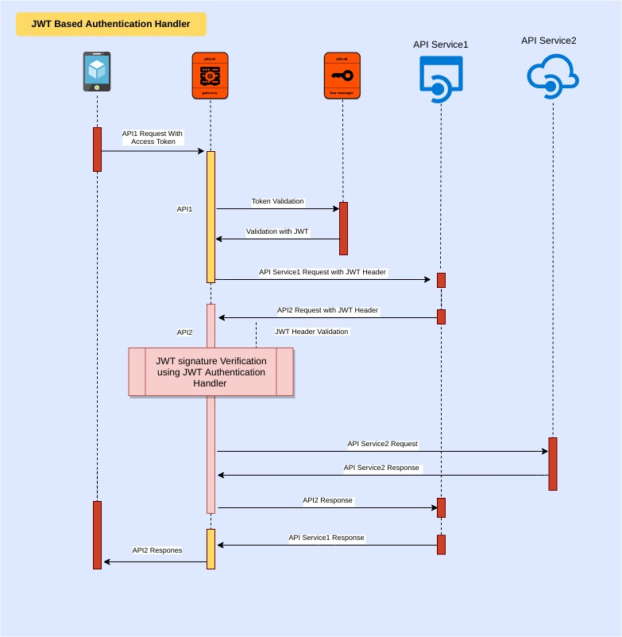

# JWT based Authentication 

JWT Authentication handler is a custom implementation for securing the service/API with JWT assertion.



#### Installation
1. Download [JWTAuthenticationHandler-1.0.0.jar](https://github.com/vanjikumaran/JWTAuthenticationHandler/blob/master/dist/JWTAuthenticationHandler-1.0.0.jar) from dist directory, into <APIM_HOME>/repository/components/lib directory.
2. Go to <APIM_HOME>/repository/deployment/server/synapse-configs/default/api/ directory and open the XML file which belongs to the API you want to add this handler.
3. Locate handlers section and remove 
   ```xml
   <handler class="org.wso2.carbon.apimgt.gateway.handlers.security.APIAuthenticationHandler"/>
   ```
4. Replace with
   ```xml
     <handler class="org.wso2.carbon.apim.custom.JWTAuthenticationHandler">
         <property name="keystorePath" value="<APIM_HOME>/repository/resources/security/wso2carbon.jks"/>
        <property name="keystorePassword" value="wso2carbon"/>
        <property name="keyAlias" value="wso2carbon"/>
   </handler>
   ```
5. Restart the server and invoke the API with X-JWT-Assertion header.


#### Development
Want to contribute? Great!
Send the pull request :) or fork and implement yours :D

#### Building for source

```git
$ git clone https://github.com/vanjikumaran/JWTAuthenticationHandler
```
```sh
$ cd JWTAuthenticationHandler/
$ mvn clean install
```
#### ToDos
 - Currently this handler only support the JWT assertion generated by WSO2; So we have evaluate possiblity of having dynamic claim mapping
 - Support multiple Signature algorithm

#### contributors
| Contributor | github |
| ------ | ------ |
| fazlan | https://github.com/fazlan-nazeem |
| vanji | https://github.com/vanjikumaran |

#### License
----
 > Licensed under the Apache License, Version 2.0 (the "License");
 > you may not use this file except in compliance with the License.
 > You may obtain a copy of the License at
 > http://www.apache.org/licenses/LICENSE-2.0
 > Unless required by applicable law or agreed to in writing, software
 > distributed under the License is distributed on an "AS IS" BASIS,
 > WITHOUT WARRANTIES OR CONDITIONS OF ANY KIND, either express or implied.
 > See the License for the specific language governing permissions and
 > limitations under the License.
 >
**Free Software, Hell Yeah!**
